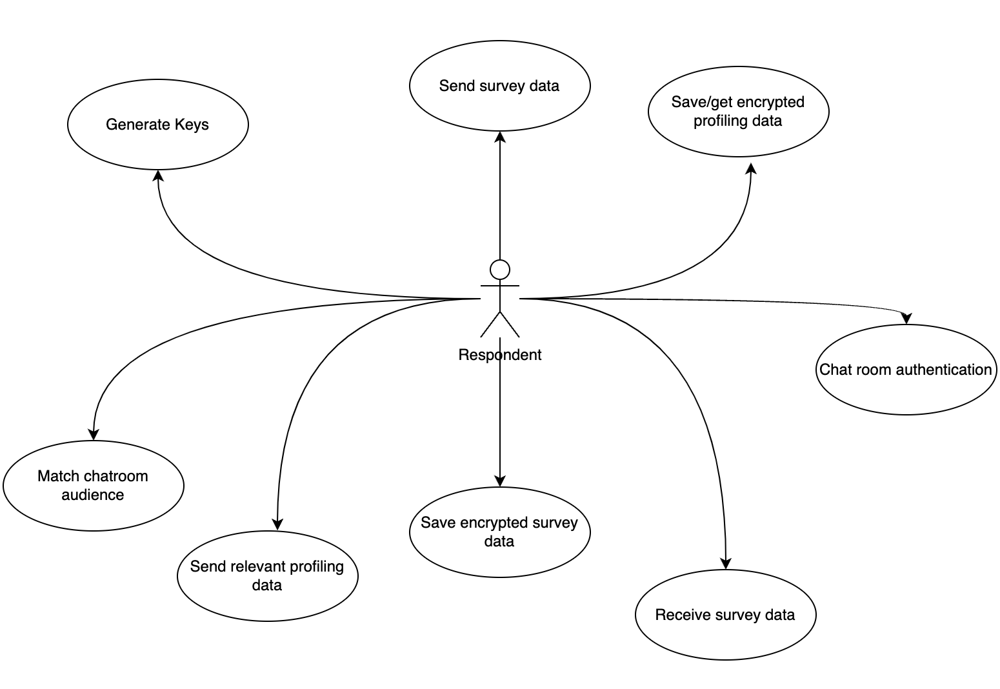
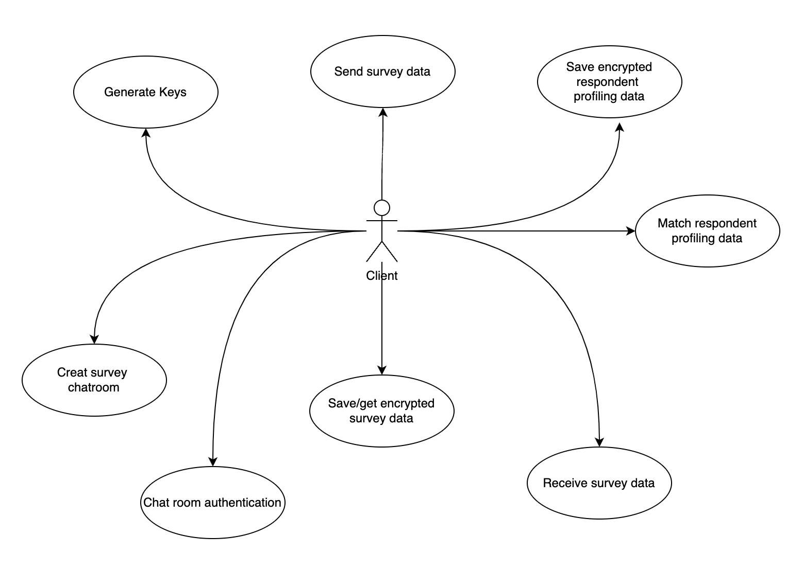
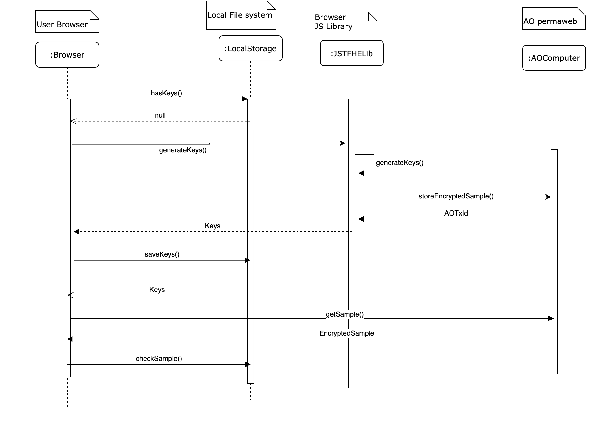
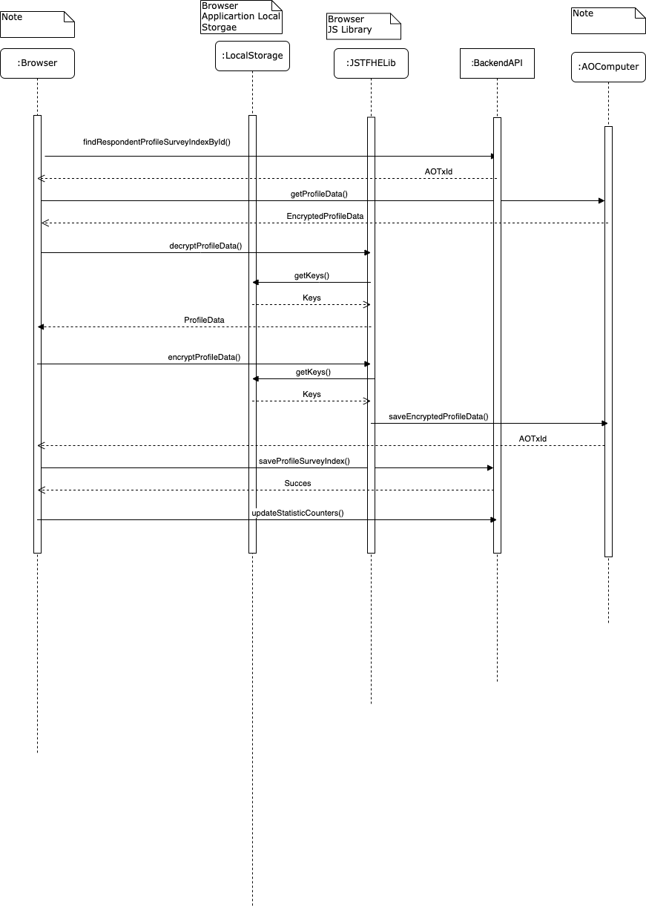
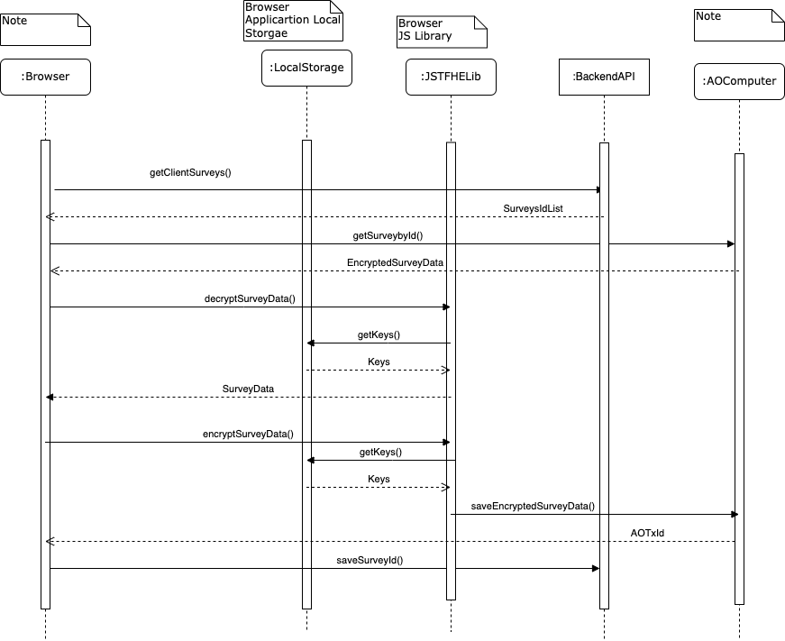
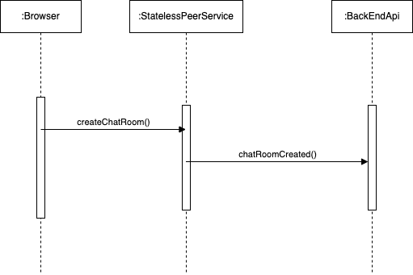
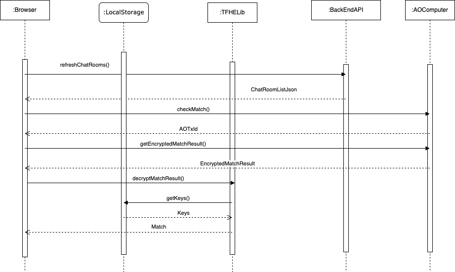
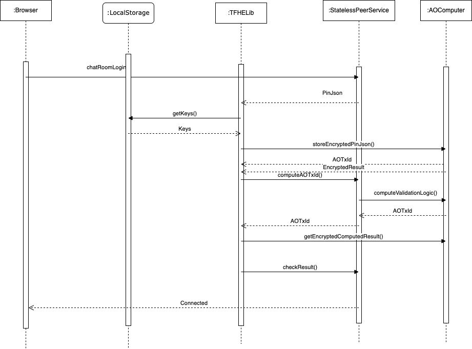
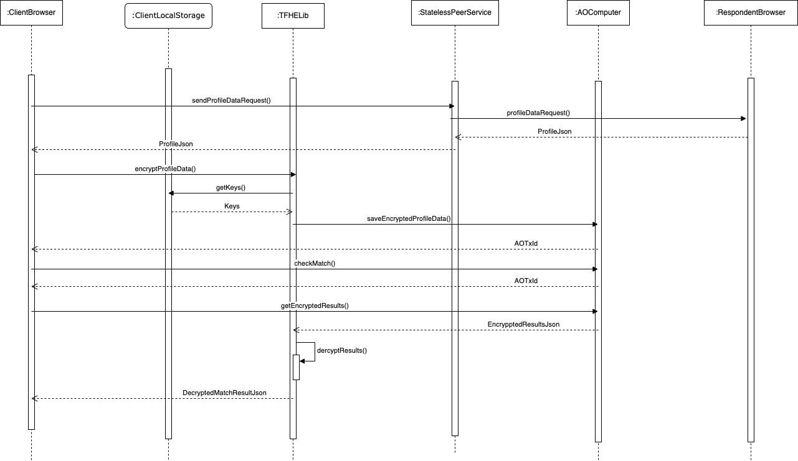
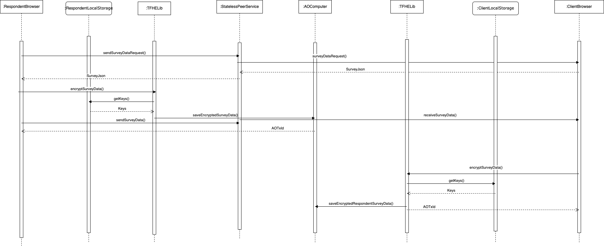

# EOC AO FHE Storage and Computation Workflows

#### Version: 0.0.1

### Abstract

This document describe how EOC implements storage and computation for the information flows that should be FHE encrypted before store in the platform.
The relevant user data will be store encrypted in AO transactions messages, and the index id data to the ao transactions will be kept into a backend system.

The EOC platform aims the "clients" to publish a market study research to the target group "respondents" and collect the the study result.
A client is define as a company or individual application account that has intention to collect market insights. A respondent is an individual account that agree to participate in market studies published by the platform.
The intention of FHE storage and computation flow is that any user of the application own his data. Neither the platform or other parties could read user data unless the user choose to transfer the data via a secure channel to the party.

## Details

The actions of the actors in this flow are described by the figure 1 and figure 2.

<b>Figure 1: FHE Flow Respondent Actions</b>

<b>Figure 2: FHE Flow Client Actions</b>

Each user type of the application is required to hold a secret key in the local system that will connect to the application portal. The public key of the user it will be kept in arweave file system. This way will help the system to run the computation logic in an AO process. The result of the computation is encrypted only the private key holer user can decrypt the information.

The information shared to others parties in the application will be send via a secure channel named FHE P2P Data Exchange.

### Generate Keys

The generate keys action is require for any user type in order to connect to a survey chart room. When a user sets that he want to use the FHE protocol. The application will check for the secret and public key settings. If the key are not present, then the browser application will start the process to generate keys. This process will run in the browser application and when the keys are generated the public key and a sample block with encrypted data will be send to a specific AO process. The AO precess will save the public key in arweave file system and the encrypted sample. When the keys are present the browser application will check for the keys compatibility with the user data.

<b>Figure 3: FHE Key Providing Process</b>

### Respondent Profiling Data Management

The responded is save encrypted into AO transactions. As AO transactions are permanently stored each change of the data will lead to save in other transaction ID. The backend system of the application will index the transactions ID. The user will get the active transaction ID to be used by the browser to decrypt the data and display it on the screen.

<b>Figure 4: FHE Respondent Profiling Data Management</b>

### Client and Respondent Survey Data Management

The survey data has a complex structure with two distinct perspectives: the client's and the respondent's.

- Client View: The client sets up the target group settings and the market study. This setup is considered client data. Once the survey study is started, the client cannot make any changes to it.
- Respondent View: The respondent receives the market study request and responds to it. This view contains both the request and the respondent's responses.

After the survey starts, the market study is sent to the matching respondents. Each respondent works on their own version of the survey. Once a respondent completes the survey, it is transferred back to the client, and the respondent can no longer make changes to it.

In essence, the system manages numerous transactions for each survey. All transactions are indexed by the backend system both the client and the respondent.

<b>Figure 5: FHE Client Respondent Survey Data Management</b>

### The survey chat room

The survey chat room is an implementation of FHE P2P Data exchange. In this implementation the life cycle of a chart room is managed by the survey status. The system will index the chart rooms in the backend system to control the state. The solution is an implementation of cloudflare workers Durable Objects, a new approach to Stateful Serverless. The peer-to-peer is manage by the users websocket connection.

<b>Figure 6: EOC Peer To Peer Data Exchange</b>  <i>Each peer owns he's data and approve's data exchange with peer user in order to engage business</i>

#### Create Survey Chat Room

Once a survey is ready for the market study the system will create the chart room. The chart room state and result are being indexed in the backend system.

<b>Figure 7: Create Survey Chat Room</b>

#### Match Chat Room Audience

All chat room survey need to have some public profile data in order the system detects the possible candidates for the survey. Only the potential candidates will be able to join the chat room.

<b>Figure 8: Match Chat Room Audience</b>

#### Chat Room Authentication

The char room authentication is a game played by the Stateless Peer Service, for each user that will required access to the chat room, the service will check the user if is connected. If a user attempt to connect from another instance browser it will be block only one secure connection for the user will be subscribed to the chat room. If the user is not connected then the game starts. The chat room will generate a Pin and send it to the user. The user need to encrypt the pin and save it to the AOComputer and send back to the chat room ao transaction id. The Stateless Peer Service chat room will start a secret computation of the encrypted pin and send the transaction of the computation to the user. The user needs to decrypt the result of the computation and send it to the chat room, if the result is accepted by the peer service chat room the user will be authenticated to the chat room

<b>Figure 9: Chat Room Authentication</b>

#### Match Chat Room Respondent Profile Data

In order that respondent agree to participate to the survey market study, the client needs to be sure that the respondent is in the target group of the research. This check will be done on the client side to avoid respondents change they profile to be validated by the survey. Once the respondent is authenticated in the char room this can sent the data to the client. The client will store the data encrypted and will run the match algorithm computation.

<b>Figure 10: Send Profiling Data</b>

#### Send and Received Survey Data

<b>Figure 11: Send Receive Survey Data</b>

## License

This repository is license under Apache License v2.0 <http://www.apache.org/licenses/LICENSE-2.0.html>
