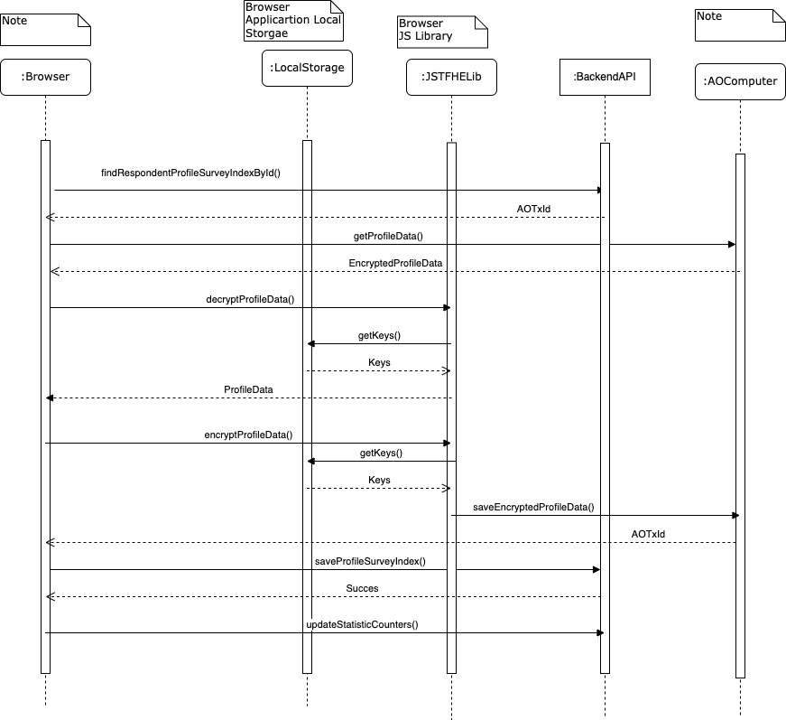

# EOC AO FHE Storage and Computation Workflows

#### Version: 0.0.1

### Abstract

This document describe how EOC implements storage and computation for the information flows that should be FHE encrypted before store in the platform.
The relevant user data will be store encrypted in AO transactions messages, and the index id data to the ao transactions will be kept into a backend system.

The EOC platform aims the "clients" to publish a market study research to the target group "respondents" and collect the the study result.
A client is define as a company or individual application account that has intention to collect market insights. A respondent is an individual account that agree to participate in market studies published by the platform.
The intention of FHE storage and computation flow is that any user of the application own his data. Neither the platform or other parties could read user data unless the user choose to transfer the data via a secure channel to the party.

## Details

The actions of the actors in this flow are described by the figure 1 and figure 2.

<b>Figure 1: FHE Flow Respondent Actions</b>

<b>Figure 2: FHE Flow Client Actions</b>

Each user type of the application is required to hold a secret key in the local system that will connect to the application portal. The public key of the user it will be kept in arweave file system. This way will help the system to run the computation logic in an AO process. The result of the computation is encrypted only the private key holer user can decrypt the information.

The information shared to others parties in the application will be send via a secure channel named FHE P2P Data Exchange.

### Generate Keys

The generate keys action is require for any user type in order to connect to a survey chart room. When a user sets that he want to use the FHE protocol. The application will check for the secret and public key settings. If the key are not present, then the browser application will start the process to generate keys. This process will run in the browser application and when the keys are generated the public key and a sample block with encrypted data will be send to a specific AO process. The AO precess will save the public key in arweave file system and the encrypted sample. When the keys are present the browser application will check for the keys compatibility with the user data.

<b>Figure 3: FHE Key Providing Process</b>

### Respondent Profiling Data Management

The responded is save encrypted into AO transactions. As AO transactions are permanently stored each change of the data will lead to save in other transaction ID. The backend system of the application will index the transactions ID. The user will get the active transaction ID to be used by the browser to decrypt the data and display it on the screen.

<b>Figure 4: FHE Respondent Profiling Data Management</b>

### Client and Respondent Survey Data Management

The survey data is a complex structure as it has two point of view. The client view of the survey in which the target group settings and the market study are setup, is the client data. The respondent view of the survey contains the market study request and the respondent response of the study. In other worlds the client can setup the survey study data, once the survey study is started the client can't change the survey. After the survey started the market study will be sent to the matching respondents, all respondents will work on his own data survey. When the respondent will finished with the survey the same survey will be transferred to the client and the respondent will not be able to change the survey. In other worlds the AO Computer will hold for a survey lots of transactions. All transaction until a client and a respondent finished with the survey will be indexed by the backend system.

<b>Figure 5: FHE Client Respondent Survey Data Management</b>

## License

This repository is license under Apache License v2.0 <http://www.apache.org/licenses/LICENSE-2.0.html>
