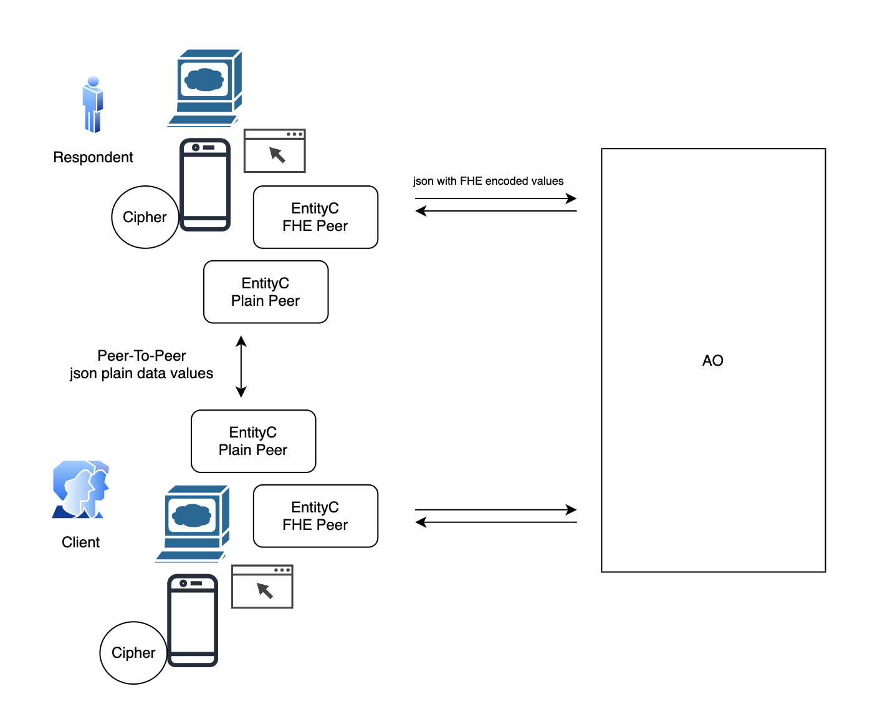

# FHE Peer To Peer Data Exchange - EOC Survey Protocol

#### Version: 0.0.1

### Abstract

This document outlines a protocol where each user retains ownership of their data. Users store their data on the Permaweb Arweave network, encrypted with their own Fully Homomorphic Encryption (FHE) private key. The corresponding public key, which can be used for computation, is also stored within the data block.

When a user requests a business engagement, other users involved are notified. Once a connection between the parties is established, the target data is securely transferred via a peer-to-peer (P2P) channel in plain text. The receiver then processes this data using their own FHE private key.

The roles and use cases of the EOC Survey Protocol will be detailed further in this document.

## Details

The EOC Survey Protocol describes all use cases and data exchanges involving parties participating in a market research survey. It outlines the process of reaching target group participants and collecting their feedback.

<i>Note: Reward grants are not included in this version.</i>

<b>Figure 1: EOC Peer To Peer Data Exchange</b>  <i>Each peer owns he's data and approve's data exchange with peer user in order to engage business</i>

### 1. Actors

There are two types of users, each with specific roles and functions. These user profiles will be referred to as "actors".

#### 1.1 Respondent

The respondent is an individual user account belonging to a private person. The primary function of the respondent is to receive notifications about potential survey studies in which they can participate and provide feedback.

#### 1.2 Client

The client is a user account associated with a private company, managed by an individual affiliated with the company. The primary function of the client is to publish survey studies aimed at gathering feedback from targeted groups of respondents.

### 2. Use cases

#### 2.1 Publish survey data

Once a client publishes a survey for feedback, all online respondents are notified. The respondent can establish a secure P2P channel to send their target group profile data to the client. The client then checks for a match and publishes the result. The result can be one of three states: "not a match," "need more details," or "match."

- <b>Not a Match:</b> If the result is "not a match," the survey ID will be excluded from the respondent's survey list.
- <b>Need More Details:</b> If the result is "need more details," the respondent will be asked to provide additional information and resend the data to the client in plain text via the secure P2P channel. The client will recheck the match and publish the updated result.
- <b>Match:</b> If the result is "match," the respondent can choose to request the survey data.

#### 2.2 Request survey

If a respondent matches the survey target group, they can request the survey from the client. The client will transfer the survey data to the respondent via a secure P2P channel. The respondent will own the survey data requested for feedback and store it as a Permaweb Arweave network block, encrypted with their own Fully Homomorphic Encryption (FHE) private key.

#### 2.3 Send survey feedback

When a respondent decides they are ready to submit the survey results, they will establish a secure P2P channel to send the data to the client.
